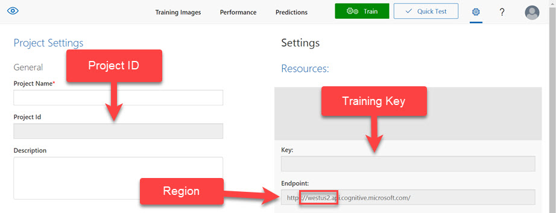

# customvision-exporter
Downloads all the tags and images for a custom vision project.

To run (via bash):
1. Clone this repo
1. Open devcontainer in VSCode
1. Run bash command:
    ````bash
    ./export-tagged-images.sh --project-id "ABC-123" --training-key "1234567890" --region "westus2"
    ````

Files and files will write out to a new directory at /output/YYYY-MM-DD_HH-MM with a JPG and associated JSON for the images

## Get Project ID, Key, and Region
You can get your project ID, training key, and region by through Custom Visions' web gui.
1. Browse and Sign into [Custom Vision](https://www.customvision.ai)
1. Open your project
1. Go to the project's settings and should see a screen like this:
    

## Run without devcontainer (linux)
1. Install jq package
    ````bash
    apt-get update && apt-get -y install --no-install-recommends jq
    ````
1. Run the bash script
    ````bash
    ./export-tagged-images.sh --project-id "ABC-123" --training-key "1234567890" --region "westus2"
    ````